# Documentación Técnica e Informe Completo de Laboratorio de Redes

## 1. Resumen y Objetivos del Proyecto

Este documento registra la arquitectura, despliegue, aseguramiento de Capa 2 y diagnóstico de conectividad de la infraestructura empresarial configurada en Cisco Packet Tracer. La solución integra una red LAN segmentada por VLANs, enrutamiento inter-VLAN, conectividad WAN redundante mediante OSPFv2 en Área 0, jerarquía de resolución de nombres DNS e integración de servicios públicos en Zona Desmilitarizada (DMZ).

### Objetivos Técnicos
- Segmentar el tráfico interno mediante redes locales virtuales (VLANs) e interfaces troncales IEEE 802.1Q.
- Mitigar vectores de ataque físicos en la red local deshabilitando interfaces inactivas en los switches corporativos.
- Interconectar la nube de proveedores ISP y el router de borde R_SOHO utilizando el protocolo de enrutamiento dinámico OSPFv2 en Área 0.
- Implementar la inyección automática de la ruta por defecto hacia la nube pública desde el router de borde.
- Publicar servicios web e infraestructura de resolución DNS pública en el segmento DMZ.
- Asegurar la resolución de nombres de dominio corporativos para clientes DHCP internos preservando la jerarquía DNS local.

---

## 2. Arquitectura de Red y Esquema de Direccionamiento

La infraestructura se divide en tres dominios principales interconectados:

```text
[ Red LAN Interna ] <---> [ R_SOHO ] <---> [ Nube WAN / ISPs ] <---> [ R_SERVERS ] <---> [ Zona DMZ ]
```

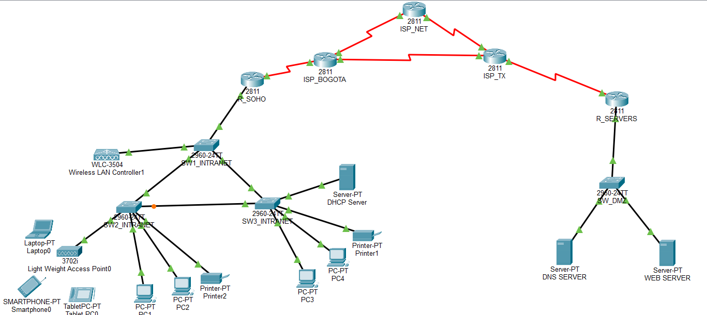

### 2.1 Segmentación de VLANs (Intranet Local)

| VLAN | Nombre / Función | Subred | Máscara | Gateway por Defecto |
| :--- | :--- | :--- | :--- | :--- |
| **VLAN 35** | Invitados / WiFi | `172.16.0.0/22` | `255.255.252.0` | `172.16.3.254` |
| **VLAN 40** | Gestión y Servidores | `172.16.8.0/24` | `255.255.255.0` | `172.16.8.254` |
| **VLAN 80** | Intranet / Datos | `172.16.4.0/22` | `255.255.252.0` | `172.16.7.254` |
| **VLAN 99** | Nativa / Administración | `172.16.9.0/24` | `255.255.255.0` | `172.16.9.254` |


### 2.2 Enlaces Punto a Punto WAN (/30)

| Enlace | Subred | Dirección IP Local | Dirección IP Remota |
| :--- | :--- | :--- | :--- |
| **R_SOHO - ISP_BOGOTA** | `200.10.10.0/30` | `200.10.10.2` (Serial0/0/1) | `200.10.10.1` (Serial0/0/1) |
| **ISP_BOGOTA - ISP_NET** | `200.20.20.0/30` | `200.20.20.1` (Serial0/2/0) | `200.20.20.2` (Serial0/2/0) |
| **ISP_BOGOTA - ISP_TX** | `200.30.30.0/30` | `200.30.30.1` (Serial0/0/0) | `200.30.30.2` (Serial0/0/0) |
| **ISP_NET - ISP_TX** | `200.40.40.0/30` | `200.40.40.1` (Serial0/2/1) | `200.40.40.2` (Serial0/2/0) |
| **ISP_TX - R_SERVERS** | `200.50.50.0/30` | `200.50.50.1` (Serial0/2/1) | `200.50.50.2` (Serial0/2/0) |


### 2.3 Segmento DMZ (/24)
- **Subred DMZ:** `200.100.10.0/24`
- **Gateway en R_SERVERS (FastEthernet0/0):** `200.100.10.1`
- **DNS Server Público:** `200.100.10.10`
- **Web Server Público:** `200.100.10.20`

---


## 3. Seguridad de Capa 2: Apagado de Puertos en Desuso

Para prevenir accesos no autorizados mediante tomas de red físicas desatendidas o ataques de desbordamiento de tablas MAC (MAC Flooding), se inspeccionó el estado de las interfaces mediante `show ip interface brief` y se apagaron los puertos inactivos.

### SW1_INTRANET
Interfaces activas identificadas: FastEthernet0/1 a FastEthernet0/3 y GigabitEthernet0/1.

```text
enable
configure terminal
interface range FastEthernet0/4 - 24
 shutdown
exit
write memory
```

### SW2_INTRANET
Interfaces activas identificadas: FastEthernet0/1 a FastEthernet0/6.

```text
enable
configure terminal
interface range FastEthernet0/7 - 24
 shutdown
exit
write memory
```

### SW3_INTRANET
Interfaces activas identificadas: FastEthernet0/1 a FastEthernet0/6.

```text
enable
configure terminal
interface range FastEthernet0/7 - 24
 shutdown
exit
write memory
```
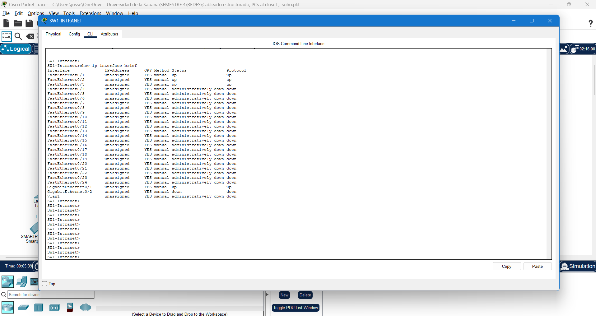

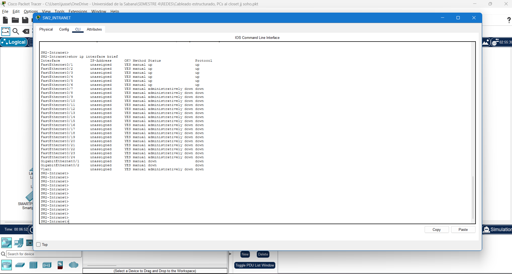

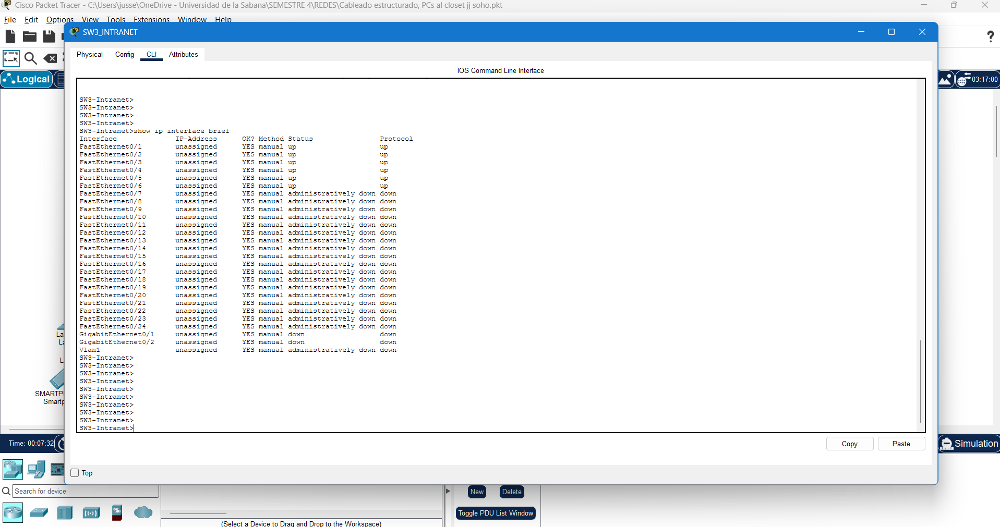
---

## 4. Enrutamiento WAN y Protocolo OSPFv2

Se configuró el protocolo OSPFv2 (Open Shortest Path First) en una arquitectura de Área Única (Área 0). OSPF calcula la ruta más corta utilizando el algoritmo Dijkstra basado en el ancho de banda de los enlaces.

### 4.1 Router R_SOHO
Configura la interfaz WAN serial, asigna la ruta estática por defecto hacia el proveedor e inyecta dicha ruta a la topología OSPF mediante el comando `default-information originate`.

```text
enable
configure terminal

interface Serial0/0/1
 description Enlace_WAN_hacia_ISP_BOGOTA
 ip address 200.10.10.2 255.255.255.252
 no shutdown
exit

ip route 0.0.0.0 0.0.0.0 Serial0/0/1

router ospf 1
 router-id 5.5.5.5
 network 200.10.10.0 0.0.0.3 area 0
 default-information originate
exit

end
write memory
```

### 4.2 Router ISP_BOGOTA
```text
enable
configure terminal

interface Serial0/0/1
 ip address 200.10.10.1 255.255.255.252
 clock rate 64000
 no shutdown
exit

interface Serial0/2/0
 ip address 200.20.20.1 255.255.255.252
 clock rate 64000
 no shutdown
exit

interface Serial0/0/0
 ip address 200.30.30.1 255.255.255.252
 clock rate 64000
 no shutdown
exit

router ospf 1
 router-id 1.1.1.1
 network 200.10.10.0 0.0.0.3 area 0
 network 200.20.20.0 0.0.0.3 area 0
 network 200.30.30.0 0.0.0.3 area 0
end
write memory
```

### 4.3 Router ISP_NET
```text
enable
configure terminal

interface Serial0/2/0
 ip address 200.20.20.2 255.255.255.252
 no shutdown
exit

interface Serial0/2/1
 ip address 200.40.40.1 255.255.255.252
 clock rate 64000
 no shutdown
exit

router ospf 1
 router-id 2.2.2.2
 network 200.20.20.0 0.0.0.3 area 0
 network 200.40.40.0 0.0.0.3 area 0
end
write memory
```

### 4.4 Router ISP_TX
```text
enable
configure terminal

interface Serial0/0/0
 ip address 200.30.30.2 255.255.255.252
 no shutdown
exit

interface Serial0/2/0
 ip address 200.40.40.2 255.255.255.252
 no shutdown
exit

interface Serial0/2/1
 ip address 200.50.50.1 255.255.255.252
 clock rate 64000
 no shutdown
exit

router ospf 1
 router-id 3.3.3.3
 network 200.30.30.0 0.0.0.3 area 0
 network 200.40.40.0 0.0.0.3 area 0
 network 200.50.50.0 0.0.0.3 area 0
end
write memory
```

### 4.5 Router R_SERVERS
```text
enable
configure terminal

interface Serial0/2/0
 ip address 200.50.50.2 255.255.255.252
 no shutdown
exit

interface FastEthernet0/0
 description Red_DMZ_Servidores
 ip address 200.100.10.1 255.255.255.0
 no shutdown
exit

router ospf 1
 router-id 4.4.4.4
 network 200.50.50.0 0.0.0.3 area 0
 network 200.100.10.0 0.0.0.255 area 0
end
write memory
```
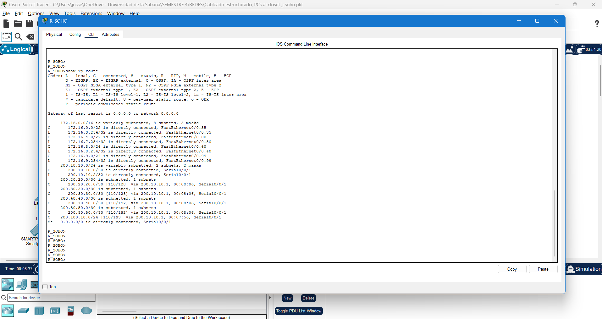

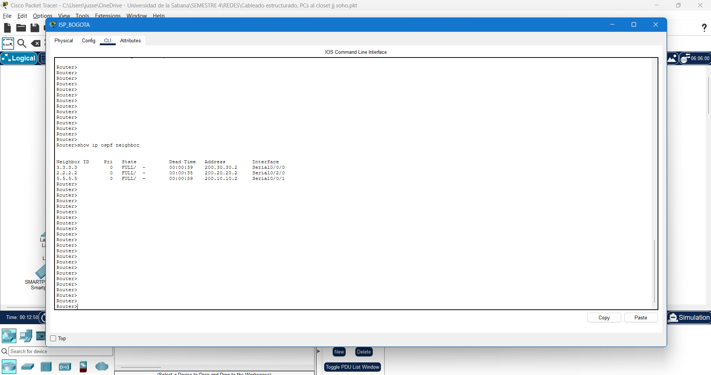

---

## 5. Servicios de Red, DMZ y Resolución de Nombres

### 5.1 Configuración de Servidores en DMZ
- **DNS Server Público (`200.100.10.10`):**
  - IP: `200.100.10.10`, Máscara: `255.255.255.0`, Gateway: `200.100.10.1`.
  - Servicio DNS habilitado (ON). Registro tipo A asociando `www.jsj.net` con `200.100.10.20`.
- **Web Server Público (`200.100.10.20`):**
  - IP: `200.100.10.20`, Máscara: `255.255.255.0`, Gateway: `200.100.10.1`.
  - Servicios HTTP y HTTPS activos (ON).

### 5.2 Estrategia de Resolución DNS Corporativa
Los clientes internos reciben la dirección IP del servidor DNS local `172.16.8.10` a través de los pools del servidor DHCP corporativo (`Server-PT DHCP Server`).

Para garantizar la resolución del dominio público sin alterar las directivas DHCP ni reconfigurar manualmente las estaciones de trabajo a direccionamiento estático:
1. Se accedió al servidor **`Server-PT DHCP Server`** (`172.16.8.10`).
2. En la pestaña **Services** -> **DNS**, se habilitó el servicio.
3. Se añadió un registro de recurso tipo A:
   - **Nombre de dominio:** `www.jsj.net`
   - **Dirección IP:** `200.100.10.20`

El cliente interno realiza la consulta a su servidor DNS local asignado y este responde directamente con la IP de la DMZ, respetando la estructura jerárquica corporativa.

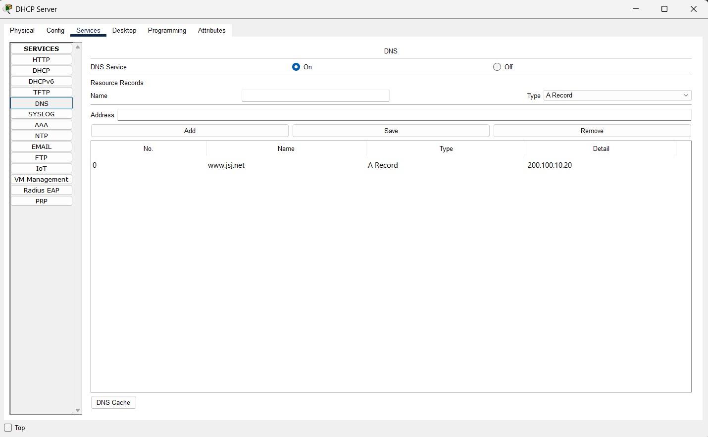

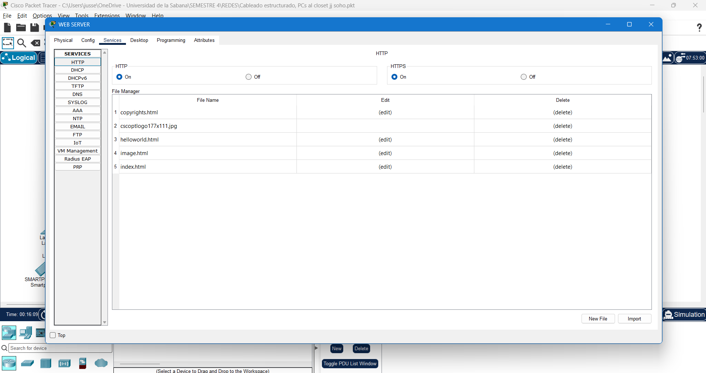

---

## 6. Infraestructura Inalámbrica y Diagnóstico de Gestión

### 6.1 Corrección de Acceso Administrativo al WLC
Durante las pruebas de administración desde PC3 y el servidor DHCP hacia la dirección IP `172.16.8.15`, el navegador desplegó el error `Server Reset Connection`.

El problema se originó por el intento de conexión mediante el protocolo HTTP no seguro (`http://172.16.8.15`). El controlador de red inalámbrica WLC 3504 requiere conexiones cifradas a través de HTTPS. Al ingresar la URL **`https://172.16.8.15`**, el WLC entregó la interfaz gráfica de inicio de sesión.

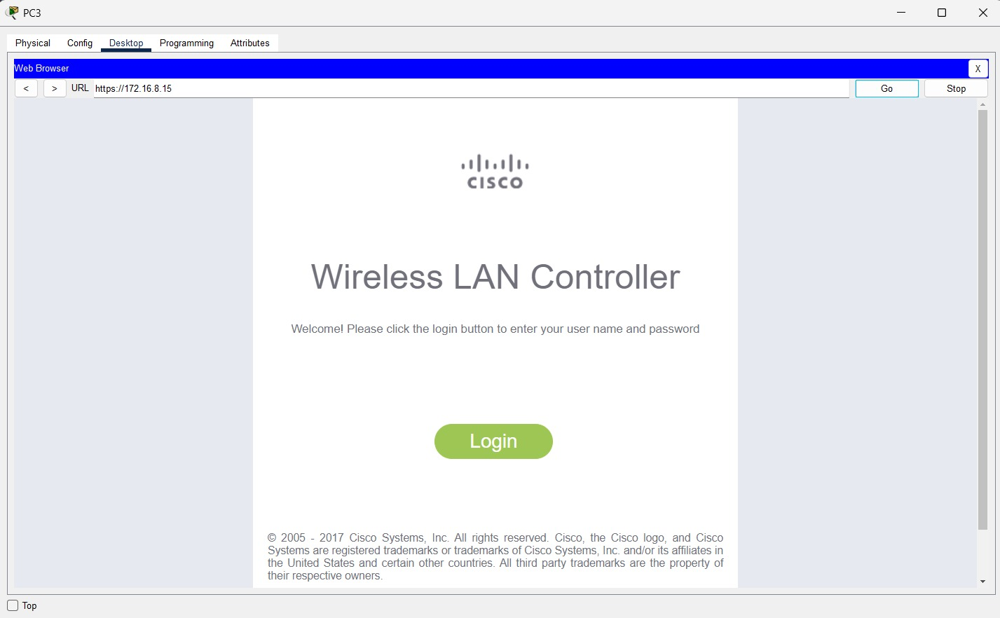

### 6.2 Habilitación de Interfaz de Switch hacia el Access Point (AP)
Se identificó que el enlace físico del switch `SW2_INTRANET` hacia el Access Point en el puerto `FastEthernet0/3` se encontraba inactivo. Se ejecutó la habilitación y asignación del enlace troncal:

```text
enable
configure terminal
interface FastEthernet0/3
 switchport mode trunk
 no shutdown
exit
end
write memory
```

---

## 7. Pruebas de Verificación y Tabla de Resultados

### 7.1 Confirmación de Tabla de Enrutamiento OSPF en R_SOHO
La ejecución del comando `show ip route` en R_SOHO verifica la convergencia de la red mediante la recepción de prefijos OSPF (código `O`):

```text
Gateway of last resort is 0.0.0.0 to network 0.0.0.0

      172.16.0.0/16 is variably subnetted, 8 subnets, 3 masks
C        172.16.0.0/22 is directly connected, FastEthernet0/0.35
C        172.16.4.0/22 is directly connected, FastEthernet0/0.80
C        172.16.8.0/24 is directly connected, FastEthernet0/0.40
C        172.16.9.0/24 is directly connected, FastEthernet0/0.99
      200.10.10.0/24 is variably subnetted, 2 subnets, 2 masks
C        200.10.10.0/30 is directly connected, Serial0/0/1
O        200.20.20.0/30 [110/128] via 200.10.10.1, Serial0/0/1
O        200.30.30.0/30 [110/128] via 200.10.10.1, Serial0/0/1
O        200.100.10.0/24 [110/192] via 200.10.10.1, Serial0/0/1
S*   0.0.0.0/0 is directly connected, Serial0/0/1
```

### 7.2 Matriz de Pruebas de Conectividad End-to-End

| Origen | Destino | Tipo de Prueba / Comando | Resultado | Estado |
| :--- | :--- | :--- | :--- | :--- |
| **PC3** | Gateway VLAN 80 (`172.16.7.254`) | `ping 172.16.7.254` | 0% pérdida de paquetes | Exitoso |
| **PC3** | Servidor DNS DMZ (`200.100.10.10`) | `ping 200.100.10.10` | 0% pérdida de paquetes | Exitoso |
| **PC3** | Servidor Web DMZ (`200.100.10.20`) | `ping 200.100.10.20` | 0% pérdida de paquetes | Exitoso |
| **PC3** | Dominio Web DMZ | `ping www.jsj.net` | Resuelve IP `200.100.10.20` | Exitoso |
| **PC3** | Servicio HTTP DMZ | Navegador Web `http://www.jsj.net` | Carga de portal index HTML | Exitoso |
| **PC3** | Gestión WLC (`172.16.8.15`) | Navegador Web `https://172.16.8.15` | Carga de panel de inicio de sesión | Exitoso |


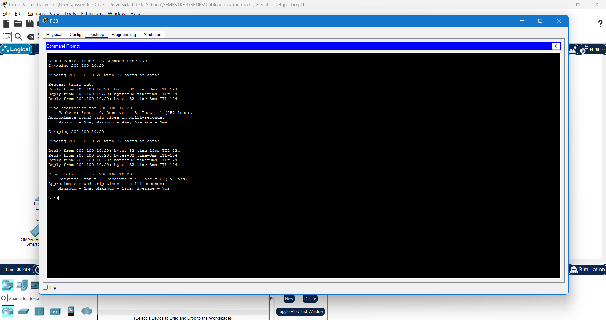

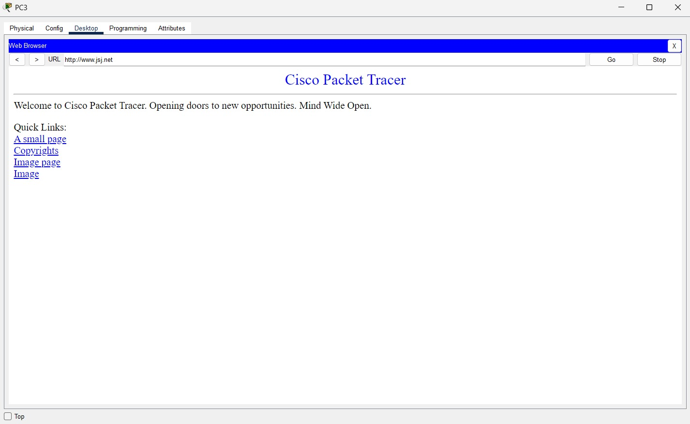

---

## 8. Registro de Prompts e Interacción con Inteligencia Artificial

Se documenta la secuencia de prompts utilizados para el diagnóstico, la generación de comandos y la resolución de problemas durante la práctica.

### Prompt 1: Análisis de Estado de Puertos y Aseguramiento
> **Prompt:** "Analiza las capturas de pantalla de los comandos 'show ip interface brief' de los switches SW1_INTRANET, SW2_INTRANET y SW3_INTRANET. Identifica los puertos sin tráfico en estado 'down/down' y genera los comandos Cisco IOS precisos para apagarlos en bloque con 'interface range' y salvar la configuración en la NVRAM."

### Prompt 2: Despliegue de Direccionamiento WAN y Protocolo OSPF
> **Prompt:** "Proporciona las secuencias de comandos Cisco IOS para los routers R_SOHO, ISP_BOGOTA, ISP_NET, ISP_TX y R_SERVERS. Asigna las direcciones IP /30 en las interfaces seriales, activa las interfaces con 'no shutdown' y configura OSPFv2 Área 0. En R_SOHO, configura la ruta por defecto y su inyección automática con 'default-information originate'."

### Prompt 3: Diagnóstico de Resolución DNS en Red Local
> **Prompt:** "Las estaciones internas reciben la IP DNS 172.16.8.10 por DHCP. Responden el ping por IP al servidor público 200.100.10.20, pero no resuelven la URL www.jsj.net. Determina si se debe editar el pool DHCP o agregar el registro A en el servidor DNS interno para resolver el nombre respetando las restricciones de la guía de laboratorio."

### Prompt 4: Diagnóstico de Errores de Conexión HTTP/HTTPS
> **Prompt:** "Al intentar acceder desde PC3 a la IP del WLC 172.16.8.15 el navegador muestra el mensaje 'Server Reset Connection'. Analiza las causas asociadas al protocolo de gestión web y proporciona la solución técnica para restablecer el acceso a la administración del controlador."

---

## 9. Referencias Bibliográficas

- Cisco Systems. (2020). *Cisco IOS Switching Services Command Reference*. Cisco Press.
- Moy, J. (1998). *OSPF Version 2* (RFC 2328). Internet Engineering Task Force (IETF). https://datatracker.ietf.org/doc/html/rfc2328
- Odom, W. (2020). *CCNA 200-301 Official Cert Guide, Volume 1*. Cisco Press.
- Odom, W. (2020). *CCNA 200-301 Official Cert Guide, Volume 2*. Cisco Press.
- Rekhter, Y., Moskowitz, B., Karrenberg, D., de Groot, G. J., & Lear, E. (1996). *Address Allocation for Private Internets* (RFC 1918). Internet Engineering Task Force (IETF). https://datatracker.ietf.org/doc/html/rfc1918